1 [Problem Statement](#step0)

2.[Project Description](#step11)

3 [Strategy of Solving the Problem](#step1)

4 [Metrics](#step2)

5 [EDA](#step3)

6 [Modelling](#step4)

7 [Hyperparameter Tuning](#step5)
8. [Testing the model in Web App](#step12)
9 [Results](#step6)

10 [Conclusions/Reflection](#step7)

11. [Improvements](#step8)

<a id='step0'></a>
## Problem Statement
### Problem Statement
With the growing needs of image recognition accross industry spectra and  applications of computer vision in almost all facets of human activities, this project aims at  developing an algorithm that could be used web app for dog images recognition and their breeds predictions. The algorithm developed will accept any user-supplied image as an input. If a dog is detected in the image, it will provide an estimate of the dog's breed. If a human is detected, it will provide an estimate of the most resembling dog breed . The user would be asked to upload another image if the supplied image is neither nor human image.

This is a Convolutional Neural Networks (CNN) project. In this project,  a pipeline  is built that is used within a web app to process real-world, user-supplied images.  Given an image of a dog, the  algorithm  developed will identify an estimate of the dogs’s breed.  If supplied an image of a human, the algorithm will identify the resembling dog breed. Finally, if the uploaded image is neither a dog nor human image is selected, the app would display the image and ask you to upload an image of a dog or human. 
The outputs of the web app are the following:
1. the image supplied to it.
2. A message that tells if the image uploaded is a dog, human or neither dog nor human.
3. The breed of the dog or the corresponding breed of the most likely dog in case of human image.
4. the wikipedia link of the dog breed where users could learn more about the dog breed. This is an impressive feature of the web app. 
If the image is neither dog nor human, the link redirects the user to the home page to upload another image.

A sample of the web app built in the project is shown below.


Along with exploring state-of-the-art CNN models for classification, this project will make important design decisions about the user experience for the  app.  The goal is that project involves breaking down a series of models designed to perform various tasks in a data processing pipeline.  Each model has its strengths and weaknesses, and engineering a real-world application often involves solving many problems without a perfect answer.  The imperfect solution will nonetheless create a fun user experience! The model at its initial deployment has an accuracy of around 73 percent. This is not perfect but does pretty jobs of successful predictions of the breeds of different dogs. 

<a id='step11'></a>
## Project Short Description

The following procedures were carried out:

1. A pre-trained human face detector was extracted and used in conjuction with open CV python library to develop a human face detector algorithm used in the project. The face detector algorithm detects all samples of 100 human images  fed to it as human faces but also detected 11 dog images as human faces. 

2. A pre-trained [ResNet-50](http://ethereon.github.io/netscope/#/gist/db945b393d40bfa26006)  model is used to detect dogs in images. along with weights that have been trained on [ImageNet](http://www.image-net.org/), a very large, very popular dataset used for image classification and other vision tasks.  ImageNet contains over 10 million URLs, each linking to an image containing an object from one of [1000 categories](https://gist.github.com/yrevar/942d3a0ac09ec9e5eb3a).  Given an image, this pre-trained ResNet-50 model returns a prediction (derived from the available categories in ImageNet) for the object that is contained in the image. The dog detector was able to completely distinguish between dogs and human faces.

3. A Convolutional Neural Network (CNN)  was created to classify dog breeds. A first attempt was to use 4 layers with different filters and Dropouts. The accuracy of this crude model was **8.6124%**. This was too low and unacceptable and led to exploration of the use of transfer learning in building the model used for the web app.

4. The first model from transfer learning uses the the pre-trained **VGG-16** model as a fixed feature extractor, where the last convolutional output of VGG-16 is fed as input to the model. Only the global average pooling layer was added and a fully connected layer, where the latter contains one node for each dog category (that is 133 in all) and is equipped with a softmax activation function. This led to a test accuracy of **38.9952%**. This was a lot much more better than the former.

5. Rather than relying on the last model which was still not effective, another model from transfer learning uses the  pre-trained **VGG-19** model as a fixed feature extractor, where the last convolutional output of VGG-19 is fed as input to the model. Only the global average pooling layer was added and a fully connected layer, where the latter contains one node for each dog category (that is 133 in all) and is equipped with a softmax activation function. This led to a test accuracy of **62.6794%**. This was a lot much more better than the previous model.

6. Another model that uses transfer learning is developed using the pre-trained **Resnet-50** model as a fixed feature extractor, where the last convolutional output of Resnet-50 is fed as input to the model. Only the global average pooling layer was added and a fully connected layer, where the latter contains one node for each dog category (that is 133 in all) and is equipped with a softmax activation function. This led to a test accuracy of **73.8038%%**. This was a lot much more better than the last model and the best of all the models. This was used in building the web app.

7. With the model fully developed, the next stage is an algorithm that would use the trained model to make predictions of breeds of dogs. The algorithm would first check if an image is a dog or human. If it is a dog image, the algorithm predicts and outputs the breed of the dog. On the other hand, if it is human image, it would report it as a human image but would predict and output the breed of the most likely resemblance of the human image.  If it was neither a dog nor a human image, the algorithm would detect that it is not either human or dog.

8. Finally, a web app was developed for users' interactions with the model. This was done using a python flask framework. In the app, users can upload any image and get results as described in the algorithm of step 7. 


<a id='step1'></a>
##  Strategy of Solving the Problem
### Strategy to solve the problem
The task is one of a classification problem - an image classification problem for that. For this reason, the best strategy would be the use of deep Convolutional Neural Network . According to wikipedia, CNN finds usefull applications in analyzing visual imagery. With shared-weight architecture, the convolution kernels or filters that slide along input features and provide translation-equivariant responses called feature maps(CNN)[[1]](https://en.wikipedia.org/wiki/Convolutional_neural_network) .Training a neural network for image classifications or segmentations is capital intensive and time consuming. Rather than re-inventing the wheel, the project uses the famous [transfer learning](https://en.wikipedia.org/wiki/Transfer_learning#:~:text=Transfer%20learning%20(TL)%20is%20a,when%20trying%20to%20recognize%20trucks) ideology with [Resnet-50](https://arxiv.org/pdf/1512.03385v1.pdf) as the original training data (model) for the model. The Resnet50 model uses 50 out of the over 100 convolutional layers used  for training 1000 images of different objects popularly known as the [ImageNet](https://en.wikipedia.org/wiki/ImageNet). 
The strategy used in the project was to use the Resnet50 as shown in the figure below as an input. This is followed by a fully connected layer with 133 filters to match the different breeds of the target. This implies removing the last fully connected layer of the Resnet50 and replacing it with a layer matching the number of classes in the new data set. This is followed by randomly initializing the weights in the new fully connected layer and initialize the rest of the weights using the pre-trained weights of the Resnet50. The new architecture is re-trained with fine-tuned hyper-parameters. 
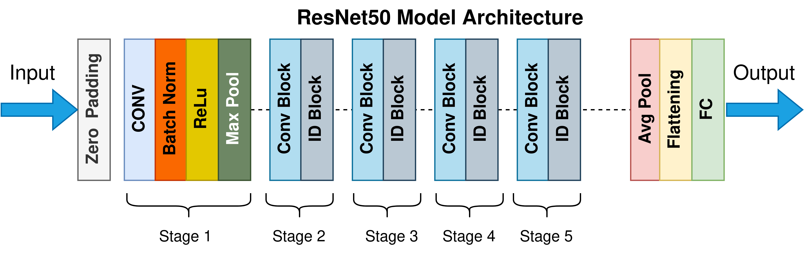. This diagram is courtesy of [wikimedia](https://upload.wikimedia.org/wikipedia/commons/9/98/ResNet50.png). 

<a id='step2'></a>
##  Metrics
### Metrics
One thing is building a model and another thing is being able to measure its performance. A great idea built into a machine learning model may be disastrous if it is deployed to perform a critical operation without testing its performance offline (that is before deployment). For this reason, a test of the model was conducted offline and **accuracy** was chosen as the metric of checking the efficacy of this model cum algorithm. The dataset used was divided into training, validation and testing data. With 133 classes to predict getting the right prediction is a great measure of performance. 

<a id='step3'></a>
## EDA
### EDA
There are two datasets used for this project, namely: dog-image and  human images made available to me by [udacity](www.udacity.com). The first dataset comprising of **8351** total dog images with **6680** images used as the training, **835** as validation and **836** test dog images. It also contains **133 total dog categories** as stated above. The second dataset comprises **13233 total human images** which was used for developing human face detector. The datasets statistics are shown in the figure below. 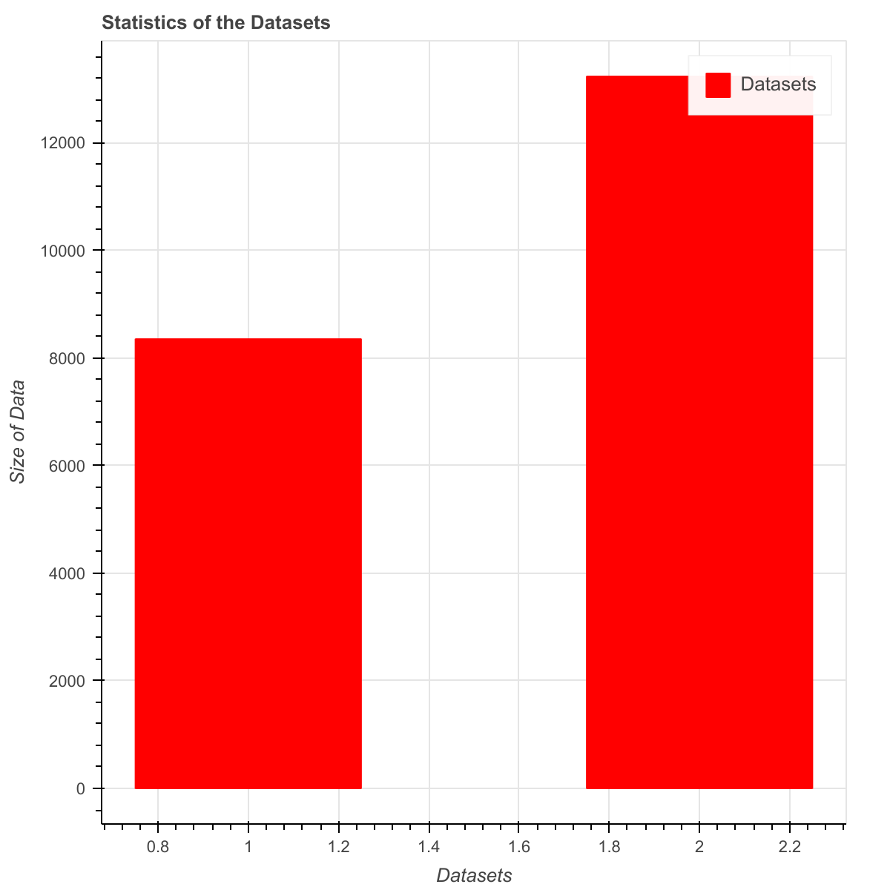.  

<a id='step4'></a>
##  Modelling
### Modelling
The modelling task was divided into four stages. Each stage leads to a different model that could be tested against the accuracy metric. Also, each model was trained for 20 epochs and batch size of 20. The stages are the following:

1. The first stage developed a model from scratch using CNN. The configurations/hyperparameters used for this model is as shown in the figure below. A Convolutional Neural Network (CNN)  was created to classify dog breeds. A first attempt was to use 4 layers with different filters and Dropouts. The accuracy of this crude model was **8.6124%** which is better than guessing for a dog breed among 133 classes of breeds. However, tis was too low and unacceptable and led to exploration of the use of transfer learning in building the model used for the web app
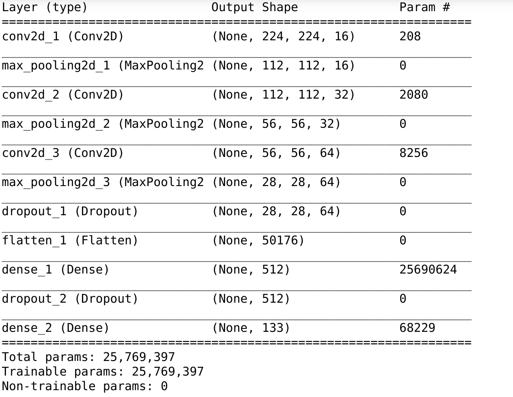. 

2. The second stage involved developing a model with a pre-trained [VGG16](https://arxiv.org/pdf/1409.1556.pdf) model with the last layer removed. The configurations are shown in the figure below. 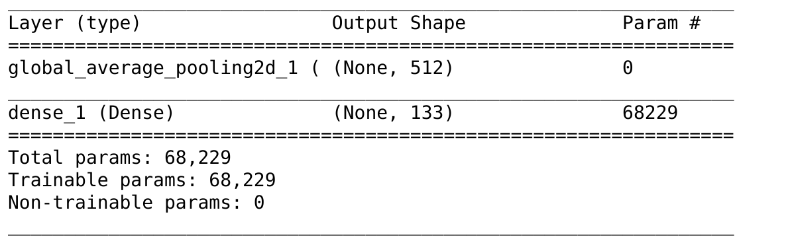.
3. The third stage uses another pretrained VGG19 model in training a new model.The configurations are shown below. 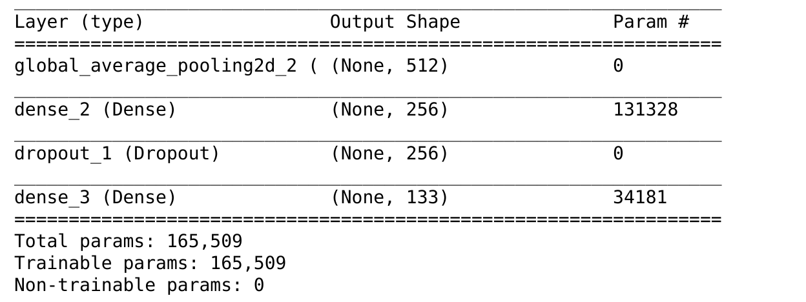. 
4. The last and the fourth stage involved the use of Resnet pre-trained model as an input in training a new model that was actually used in developing a web app for this project. The archiecture of the input Resnet50 pre-trained model was shown above under **Strategy for Solving the Problem**. The configurations of the hyperparameter used in addition to the pre-trained Resnet50 is as shown below. The explanations of this hyperparameters are provied under __hyperparameters tuning__ section below. 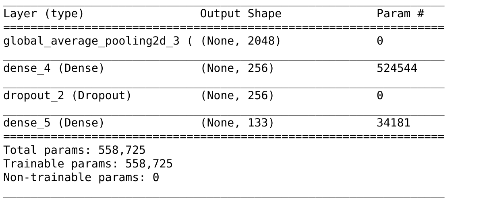.


<a id='step5'></a>
## Hyperparameter Tuning
### Hyperparameter Tuning

The hyperparameters that were for the models development include: 

* number of convolutional layers
* filters
* kernel or window size 
* pooling layers - helps in reducing dimensionality of the filters. This could be Max Pooling or Global Average Pooling layer.
* dropout layer
* dense layer - a layer with full connection to the preceding layer. It is important to realize fully connected layer.
* number of strides
* padding - This decides whether an image should be padded with zeros or not
* activation function

These parameters were manually adjusted to obtain different results. 

<a id='step12'></a>
## Tesing the Model in the Web App
Results speak for themselves. The model does great predictions. All the test images fed into the algorithm were able to receive correct classification of whether they are dogs, humans or neither. The algorithm does well too in predicting that cats are not dogs. The only noticeable difficulty so far is on the most likely dog breeds of human images. When fed with different images of the same human being, the model returns different corresponding dog breeds. It could be understandable that it could not make such recognition, because of different colors of clothing present in the human images. 

The outputs of the model for different inputs are as shown in the diagrams below.

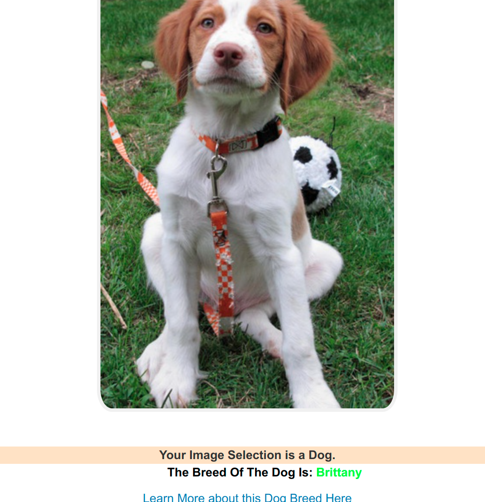

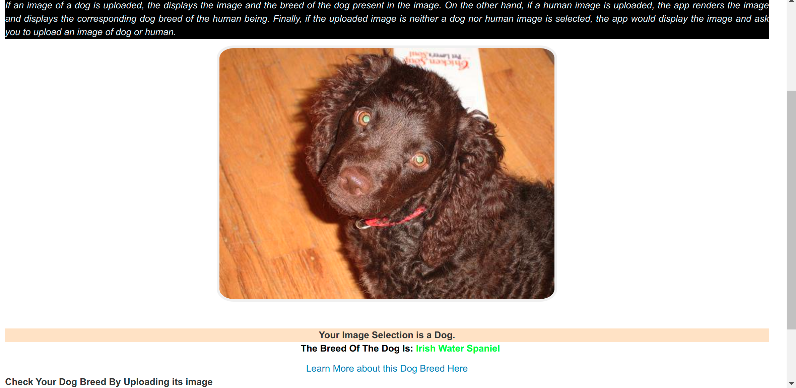
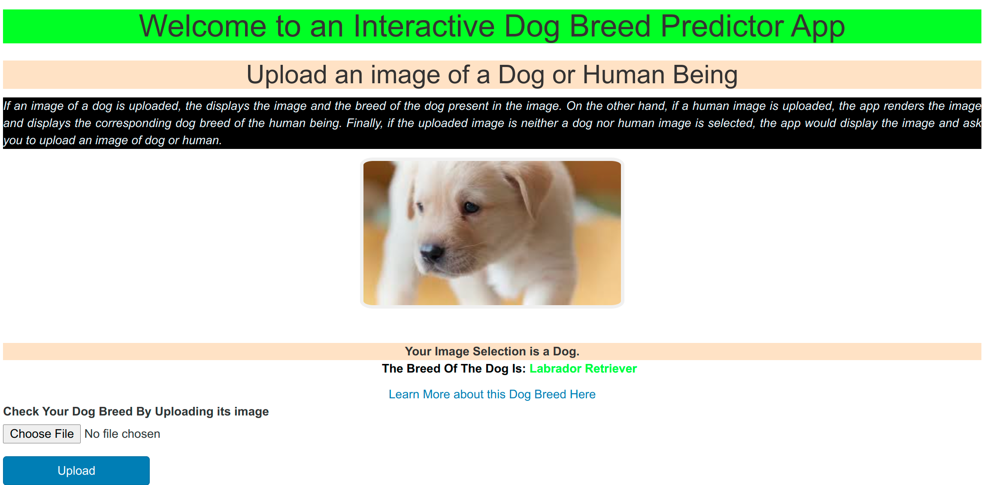
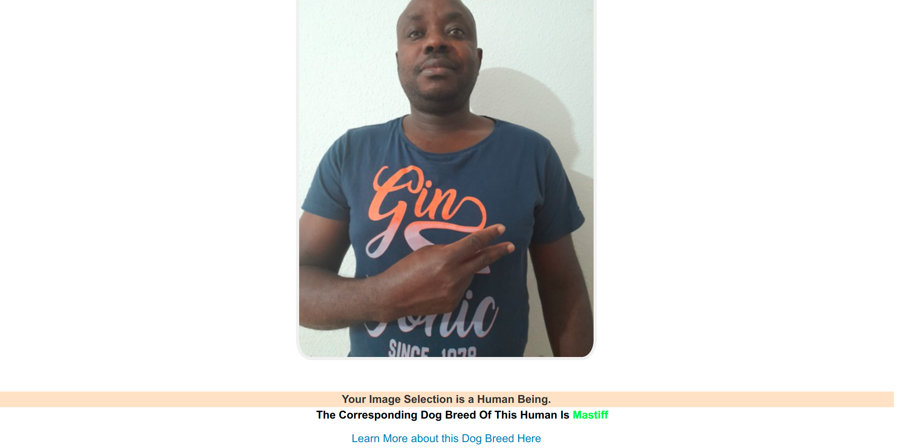


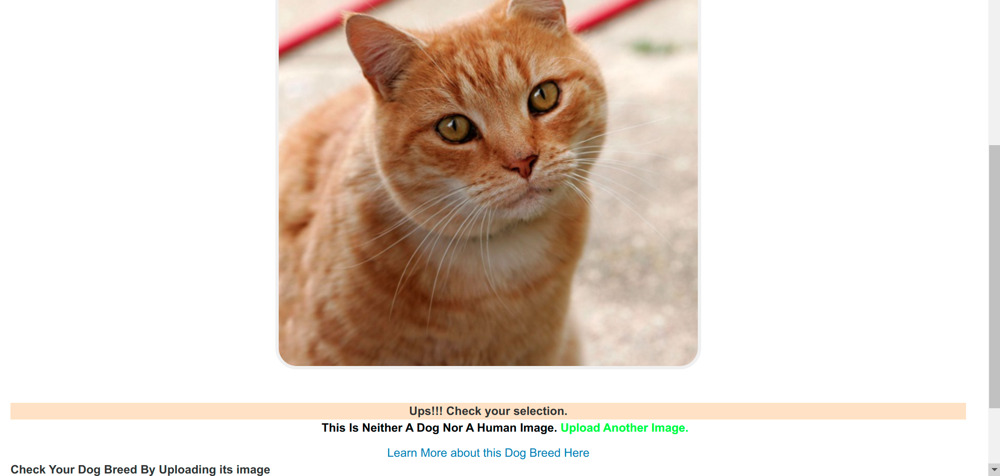

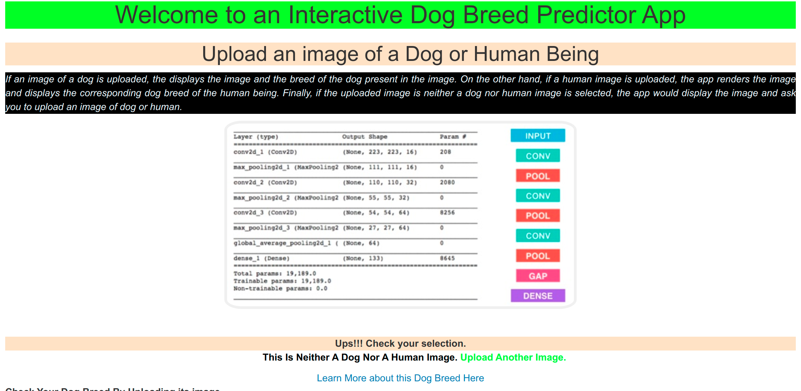

<a id='step6'></a>
## Step 6: Results
### Results
The above four models were measured tested against validation datasets that were not part of the training datasets to measure their accuracies. Their results are shown in the table below. 
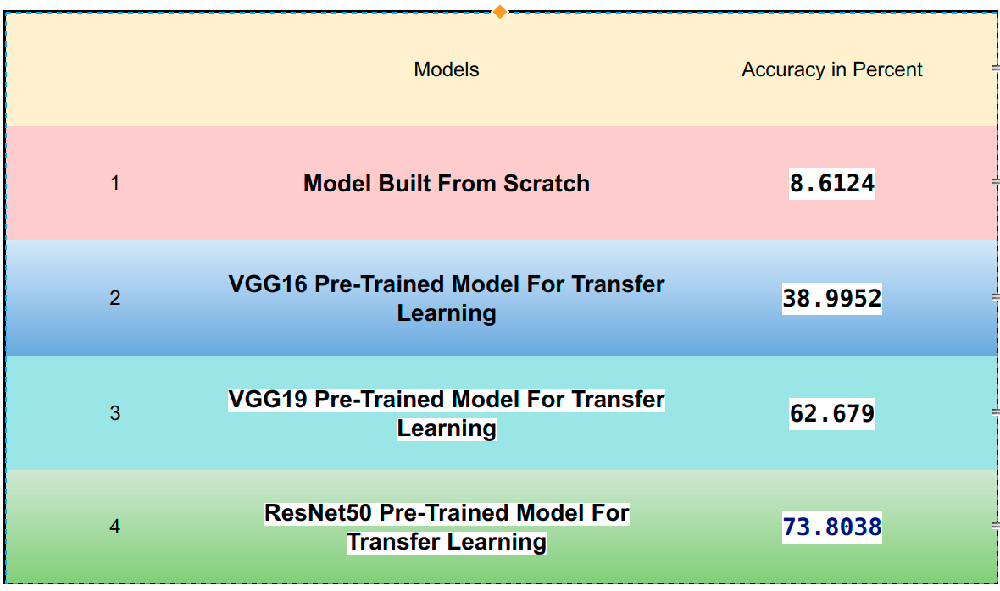

<a id='step7'></a>
## Step 7: Conclusion/Reflection

### Conclusion/Reflection
The progressive performances of the various models explored in this project are quite remarkable. First, the crude model developed from scratch performed 10 times better than guessing which breed of dog is present. Secondly, the VGG16 pre-trained model used in a transfer learning to build the second model is at least 4 times better than the model built from the scratch. The third model is roughly 2 times better than the second model while the last model recorded more than 17 percent improvement over the third. 

<a id='step8'></a>
## Step 8: Improvements
## Improvements
The algorithm is far from being ideal. Some human images of a the individual in different outfits returned different predictions of the most likely resemblance of varying dog breeds. Areas of improvement to make the algorithm better include:
 
 * Perform data augmentation to avoid over fitting since the dataset is relatively small in size.
 * Develop another human detector that would be able to detect human images and filter out dog images. 
 * The hyperparameters could be tuned better by further permutations. 
 * The number of epochs used in the model could be increased to enhance the accuracy of the model. 


##  Instructions on How to Run the Web App.

1. Change directory to the **/app** directory.
2. Install the necessary software as follows:

``` pip install -r requirements.txt```

3. Run:

	```python run.py```

3. Go to the following endpoint in your favourite web browser:

	```http://127.0.0.1:5000/ ```

4. Interact with the web app there.


### Acknowledgement
This project is done as a part of Udacity's Data Science Nanodegree program. Many thanks to the Udacity instructors and mentors for their guidance and supports.

### References

*  [Bird Prediction in Streamlit](https://github.com/Joshmantova/Eagle-Vision)

* [[Convolutional_neural_network]](https://en.wikipedia.org/wiki/Convolutional_neural_network)

* [VGG16](https://arxiv.org/pdf/1409.1556.pdf)

* [wikimedia](https://upload.wikimedia.org/wikipedia/commons/9/98/ResNet50.png)

* [ImageNet](http://www.image-net.org/)

* [ResNet-50](http://ethereon.github.io/netscope/#/gist/db945b393d40bfa26006)